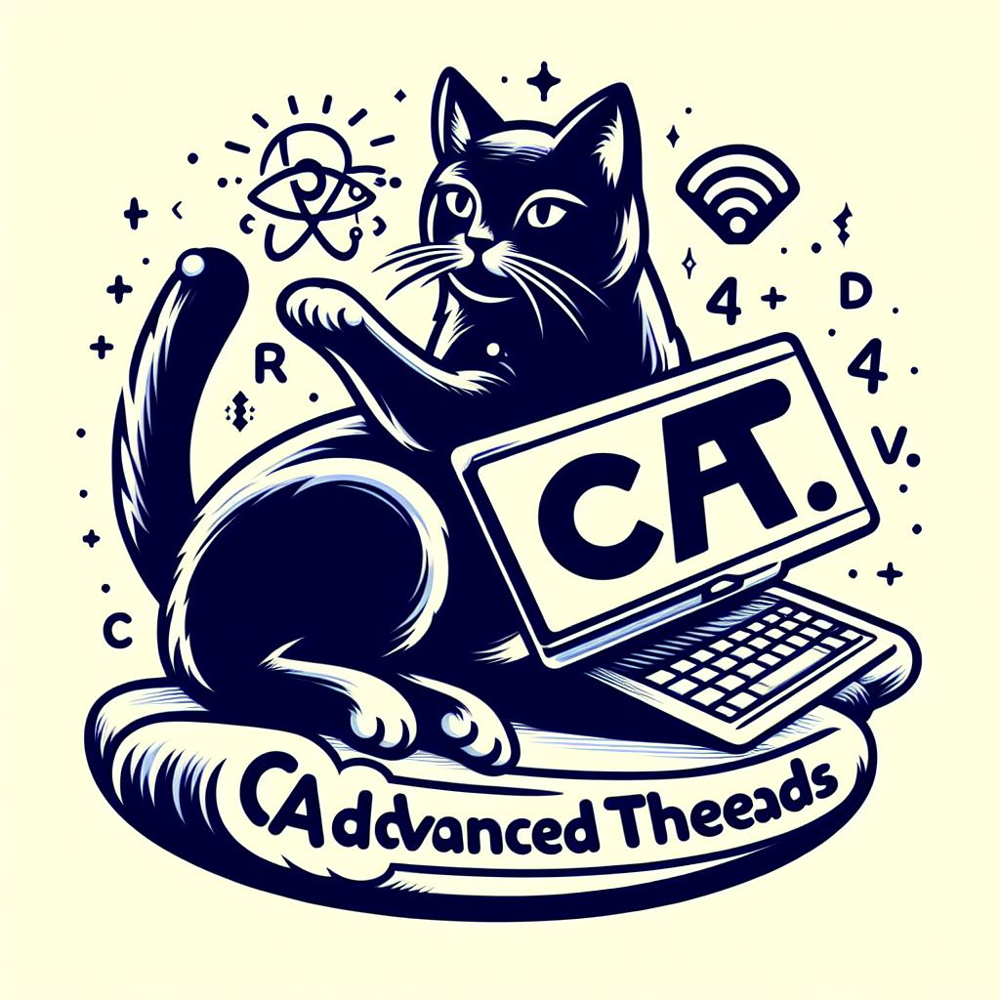

# CAT | C Advanced Threads Library


Cat is an advanced Multi-Threading shared library build on POSIX threads to create more advanced capabilities to C developers without writing their own libraries dozen of times and aims to reduce boiler-plate code for projects.

## Installation
Cat is a dynamically shared library. So you don't need to directly copy the headers into your project. Instead clone this repo and run :

```bash
sudo ./install_libcat.sh
```

This script installs the library system-wide into your machine and let you able to use Cat like this:
```c
#include <cat/thread_pool.h>

thread_pool_t *pool = thread_pool_init(5);
.
.
.
```
If you want to remove the Cat from your system, you can just run similiar uninstallation script like this:

```bash
sudo ./uninstall_libcat.sh
``` 

## License
Cat is under [GNU General Public License v3.0](./LICENSE)